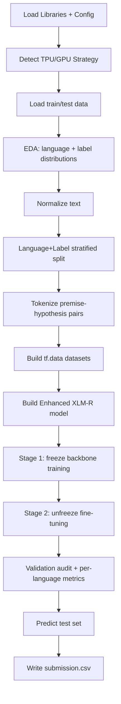
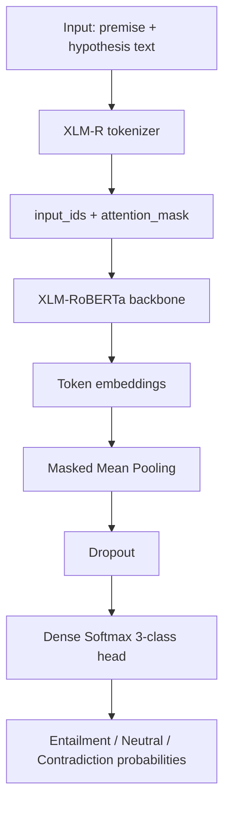

# Multilingual NLI (Merged + Enhanced)

This repository now contains a single notebook:

- `nli_merged_enhanced.ipynb`

It solves the Kaggle **Contradictory, My Dear Watson** task (multilingual Natural Language Inference).

## Dataset

Source: Kaggle competition dataset `contradictory-my-dear-watson`.

- Task: classify relation between `premise` and `hypothesis`
- Labels:
  - `0`: Entailment
  - `1`: Neutral
  - `2`: Contradiction
- Languages: 15 multilingual languages
- Main files used in notebook:
  - `train.csv` (includes labels)
  - `test.csv` (for inference)
  - `sample_submission.csv`

Expected Kaggle input paths:

- `../input/contradictory-my-dear-watson/train.csv`
- `../input/contradictory-my-dear-watson/test.csv`
- `../input/contradictory-my-dear-watson/sample_submission.csv`

## Notebook Flow (Vertical)

## Stack Used

- Python 3
- TensorFlow / Keras
- Hugging Face Transformers
- scikit-learn
- NumPy, pandas
- Plotly (visualizations)

## Model Used

- Backbone: `joeddav/xlm-roberta-large-xnli`
- Head: masked mean pooling + dropout + dense softmax classifier
- Output classes: 3 (`entailment`, `neutral`, `contradiction`)

## Techniques Used

- Transfer learning with multilingual transformer
- Premise-hypothesis pair encoding
- Text normalization (`NFKC`, whitespace cleanup)
- Language+label stratified validation split
- Masked mean pooling
- Dropout regularization
- Class weights for training balance
- Label smoothing
- AdamW optimizer
- Cosine learning-rate decay
- Gradient clipping
- Early stopping
- Two-stage fine-tuning (freeze then unfreeze)
- Per-language validation diagnostics

## Model Architecture (Vertical)

## How to Use

1. Open `nli_merged_enhanced.ipynb` in Kaggle or Jupyter.
2. Ensure the Kaggle dataset is attached at `../input/contradictory-my-dear-watson/`.
3. Run all cells in order.
4. After training/inference, collect `submission.csv` generated by the notebook.
5. Submit `submission.csv` to the Kaggle competition.

## Output

- `submission.csv` with columns:
  - `id`
  - `prediction`
